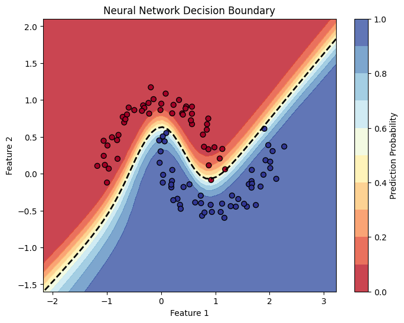

# retrograd

`retrograd` is a lightweight automatic differentiation engine that implements backpropagation (reverse-mode autodiff). It also includes a small deep-learning library built on top of the engine, providing an API for creating neural networks.

## Core Engine: `Value`

The core of the engine is the [`retrograd.engine.Value`](retrograd/engine.py) class. It's a wrapper around a single scalar value that tracks its computational history. This history is stored as a directed acyclic graph (DAG), which allows for the automatic computation of gradients for any node with respect to any of its ancestors.

### Supported Operations

The `Value` object supports a variety of mathematical operations:

- **Arithmetic**: Addition (`+`), Subtraction (`-`), Multiplication (`*`), Division (`/`), Power (`**`)
- **Activations & Non-linearities**:
  - `tanh()`: Hyperbolic Tangent
  - `relu()`: Rectified Linear Unit
  - `sigmoid()`: Sigmoid
  - `exp()`: Exponential
  - `log()`: Natural Logarithm

### Example: Autograd Engine

Here is a simple example of defining an expression and performing backpropagation to compute gradients.

```python
from retrograd.engine import Value

# Define a simple expression L = d * f, where d = (a*b) + c
a = Value(2.0, label='a')
b = Value(-3.0, label='b')
c = Value(10.0, label='c')
f = Value(-2.0, label='f')

e = a * b; e.label = 'e'
d = e + c; d.label = 'd'
L = d * f; L.label = 'L'

# Compute gradients of all nodes with respect to L
L.backward()

# The gradients are stored in the .grad attribute
print(f"dL/da: {a.grad}") # Expected: -2.0 * -3.0 = 6.0
```

## Neural Network Library

Built upon the `Value` object, [neural.py](retrograd/neural.py) provides simple abstractions for building neural networks.

- `Neuron`: A single neuron with weights and a bias.
- `Layer`: A layer of neurons.
- `MLP`: A Multi-Layer Perceptron.

### Example: Building an MLP

You can easily define and use a multi-layer perceptron.

```python
from retrograd.neural import MLP

# Create an MLP with 3 input neurons, two hidden layers of 4 neurons each,
# and one output neuron.
model = MLP(n_inputs=3, layer_sizes=[4, 4, 1])

# Perform a forward pass
x = [2.0, 3.0, -1.0]
output = model(x)
```

## Demonstrations

The repository includes two Jupyter notebooks to demonstrate the capabilities of retrograd.

### [demo.ipynb](demo.ipynb)

[demo.ipynb](demo.ipynb) showcases a complete training loop. It demonstrates how to:

1.  Initialize an `MLP` model.
2.  Train the model on the `make_moons` dataset from scikit-learn.
3.  Implement a binary cross-entropy loss function.
4.  Run a training loop with forward pass, backpropagation, and parameter updates.
5.  Visualize the final decision boundary of the trained classifier.

<p align="center">

</p>

### [trace_graph.ipynb](trace_graph.ipynb)

[trace_graph.ipynb](trace_graph.ipynb) provides utilities to visualize the computational graph created by the engine. The `draw_dot` function can be used on any `Value` object to generate a graph showing all the constituent operations and values, along with their data and gradients after a backward pass. This is incredibly useful for debugging and for understanding the flow of backpropagation.

<p align="center">

</p>